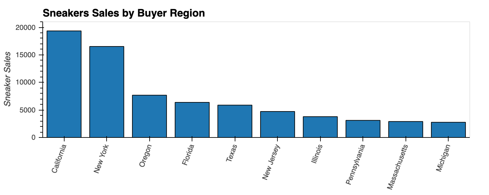
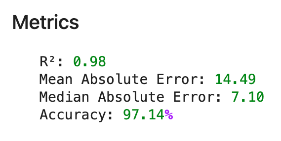

## Table of Contents

* [Summary](#summary)
* [Resources](#resources)
* [Exploratory Data Analysis](#exploratory-data-analysis)
  * [Analysis by Sneakers Name](#analysis_by_sneakers_name)
  * [Analysis by Retail Price](#analysis_by_retail_price)
  * [Analysis by Shoe Size](#analysis_by_shoe_size)
  * [Analysis by Region](#analysis_by_region)
  * [Analysis by Ordered Date](#analysis_by_ordered_date)
  * [Analysis by Average Resale Price](#analysis_by_average_sales_price)  
* [Modeling](#modeling)
---
## Summary

---
## Data Source 

StockX provided data in 2019 as part of its [StockX Data Contest](https://stockx.com/news/the-2019-data-contest/), te dataset consist of 99,956 transactions from 2017 to 2019, two brands, and over 50 different styles. 

---
## Exploratory Data Analysis
Using the dataset provide by StockX we evaluated the different aspects 
[Sneakers Analysis](MarketAnalysis/notebooks/Sneakers_Data_Analysis.ipynb)

### Analysis by Sneaker Name

### Analysis by Retail Price

### Analysis by Shoe Size

### Analysis by Region

### Analysis by Average Resale Price

---
## Modeling
[Random Forest Regression](MarketAnalysis/notebooks/Random_Forest_Regression.ipynb)

### Parameters

### Results

